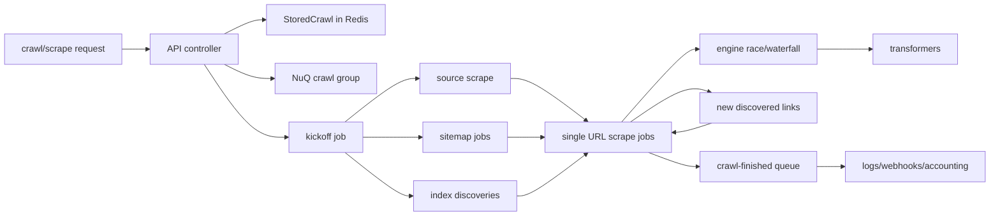

# Firecrawl Deep Architecture Study

> `findings/` document: contains inferences. Grounded in observations from
> `../../investigations/firecrawl-firecrawl/architecture.md` and
> `../../investigations/firecrawl-firecrawl/source-study.md`. No Firecrawl source is copied here.

## Conclusion

Firecrawl is best understood as a production crawling platform, not a single scraper. The
center of gravity is `apps/api`, but the important architecture is the flow from API request
to persisted crawl group, queued kickoff, fan-out into many scrape jobs, engine selection,
result transformation, billing/logging, and crawl finalization.

The first-pass finding was directionally right that `apps/api` dominates the system, but it
understated the queue layer. The deep pass confirms that Firecrawl has at least four distinct
work-dispatch mechanisms: BullMQ/Redis side queues, RabbitMQ-backed extract work, a custom
Postgres-backed NuQ scrape queue, and a FoundationDB NuQ migration path.

## Evidence Base

`[observation]` Blacklight's static graph found `1339` nodes, `4087` edges, and `592` concepts.
`apps/api` is the dominant component with about `700` files in the generated component summary.

`[observation]` The manual study measured `658` files under `apps/api/src`, including `651`
TypeScript files, and `1804` `test(`/`it(` occurrences across the API, Playwright service, and
JS SDK.

`[observation]` The cached checkout studied was commit
`3a7b1a7774291f6c1a72ff3eb0ac11187766723d`, dated `2026-07-15 09:44:04 -0700`.

## Runtime Shape

`[infer]` The core Firecrawl flow is:

The crawl controller creates the stored crawl, pins a queue backend, creates a crawl group,
persists the crawl, marks it active, and enqueues kickoff. The worker dispatches by job mode:
`kickoff`, `kickoff_sitemap`, or `single_urls`. Kickoff starts the crawl, discovers sitemap and
index candidates, locks URLs, and bulk-enqueues child scrape jobs. Single URL jobs run the
scrape pipeline and then discover more links.

## Queue Architecture

`[infer]` Firecrawl's queue layer is the system's load-bearing mechanism. It is more complex
than a typical BullMQ app because the scrape workload needs group semantics, team/api-key
concurrency, backlog timeouts, crawl completion, wait-for-job behavior, zero-data-retention,
and a migration path from Postgres to FoundationDB.

The major pieces are:

- BullMQ/Redis for side queues such as deep research, generate-llms-txt, billing, and precrawl.
- RabbitMQ with DLQ behavior for extract jobs.
- NuQ for scrape and crawl-finished jobs.
- NuQ router for Postgres/FoundationDB dual backend migration.
- Redis mirrors for old concurrency counters and crawl state.

`[infer]` A particularly reusable pattern is backend pinning at group creation. New crawl groups
choose PG or FDB once; later reads and child jobs follow the stored crawl/job markers. That
keeps most call sites from carrying migration logic.

## Scrape Engine Design

`[infer]` The scrape pipeline is a strategy engine. It turns request options into feature flags,
builds a `Meta` object, checks threat protection and robots, chooses a fallback list from a
support matrix, races or waterfalls engines, and runs transformers on the winning result.

Supported engine families include:

- index cache
- Fire Engine CDP/TLS variants
- Playwright
- plain fetch
- PDF and document handlers
- Wikipedia
- X/Twitter

The important design move is that engine choice is explicit. Each engine declares feature
support and quality; request features like actions, screenshot, PDF/document, audio/video,
location, mobile, stealth proxy, branding, and fast mode change the fallback list.

## Boundaries

`[infer]` Browser execution is intentionally out-of-process. The API talks to
`apps/playwright-service-ts`, which owns Chromium lifecycle and page concurrency. That boundary
reduces blast radius for memory-heavy browser work and gives self-hosted deployments a clear
resource-tuning point.

`[infer]` Hosted-vs-self-hosted capability is a real architecture boundary. The self-host docs
say advanced Fire Engine capability is limited outside the hosted setup, while the code still
contains Fire Engine routes, GCS, billing, Supabase, and team flag integrations. Any Blacklight
analysis should label which behavior is self-host-observable and which is hosted-service
dependent.

## Reusable Blacklight Lessons

- Model long work as persisted groups plus resumable small jobs.
- Keep raw crawl state separate from queue state, but link them by stable IDs.
- Lock discovered URLs before enqueue to prevent duplicate fan-out.
- Treat queue backend migration as routing plus pinned group/job markers.
- Use a feature support matrix for strategy selection rather than burying engine preference in
  scattered conditionals.
- Keep browser execution behind a narrow service boundary.
- Put metrics, spans, and structured logs at every transition so runtime traces can explain the
  system after the fact.

## Updated Unknowns

This source study reduced the earlier uncertainty around queue/worker shape. Remaining
unknowns are operational rather than structural: runtime timing under load, FDB behavior in a
real deployment, hosted Fire Engine behavior, and self-host-vs-cloud differences. These are
tracked in `../../investigations/firecrawl-firecrawl/unknowns.md`.
