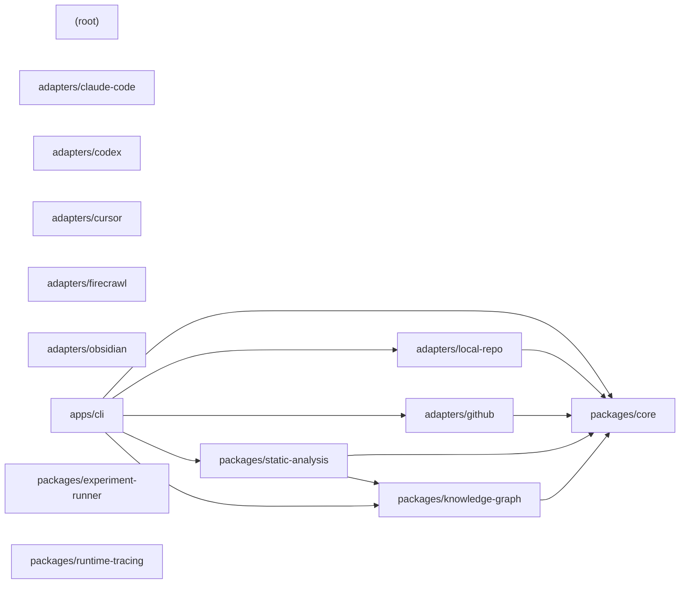

# Architecture — Blacklight - system anatomy

> Generated by Blacklight 0.1.0 on 2026-07-15T20:45:33.528Z.
> Target: `C:\Users\yulon\Desktop\Current Projects\Blacklight - system anatomy` (local-repo).
>
> This is an **observation skeleton**: 176 observed facts, 56 inferred.
> Interpretation and conclusions belong in `findings/architecture/`, not here.

## Components

| Component | Files | Path |
| --- | --- | --- |
| `(root)` | 15 | `` |
| `adapters/claude-code` | 1 | `adapters/claude-code` |
| `adapters/codex` | 1 | `adapters/codex` |
| `adapters/cursor` | 1 | `adapters/cursor` |
| `adapters/firecrawl` | 1 | `adapters/firecrawl` |
| `adapters/github` | 2 | `adapters/github` |
| `adapters/local-repo` | 2 | `adapters/local-repo` |
| `adapters/obsidian` | 1 | `adapters/obsidian` |
| `apps/cli` | 8 | `apps/cli` |
| `packages/core` | 10 | `packages/core` |
| `packages/experiment-runner` | 1 | `packages/experiment-runner` |
| `packages/knowledge-graph` | 6 | `packages/knowledge-graph` |
| `packages/runtime-tracing` | 1 | `packages/runtime-tracing` |
| `packages/static-analysis` | 10 | `packages/static-analysis` |

## Dependencies

- `adapters/github` → `packages/core`
- `adapters/local-repo` → `packages/core`
- `apps/cli` → `adapters/github`
- `apps/cli` → `adapters/local-repo`
- `apps/cli` → `packages/core`
- `apps/cli` → `packages/knowledge-graph`
- `apps/cli` → `packages/static-analysis`
- `packages/knowledge-graph` → `packages/core`
- `packages/static-analysis` → `packages/core`
- `packages/static-analysis` → `packages/knowledge-graph`

## Component diagram

## Graph size

- Nodes: 83 (32 files, 14 components, 37 concepts)
- Edges: 149
