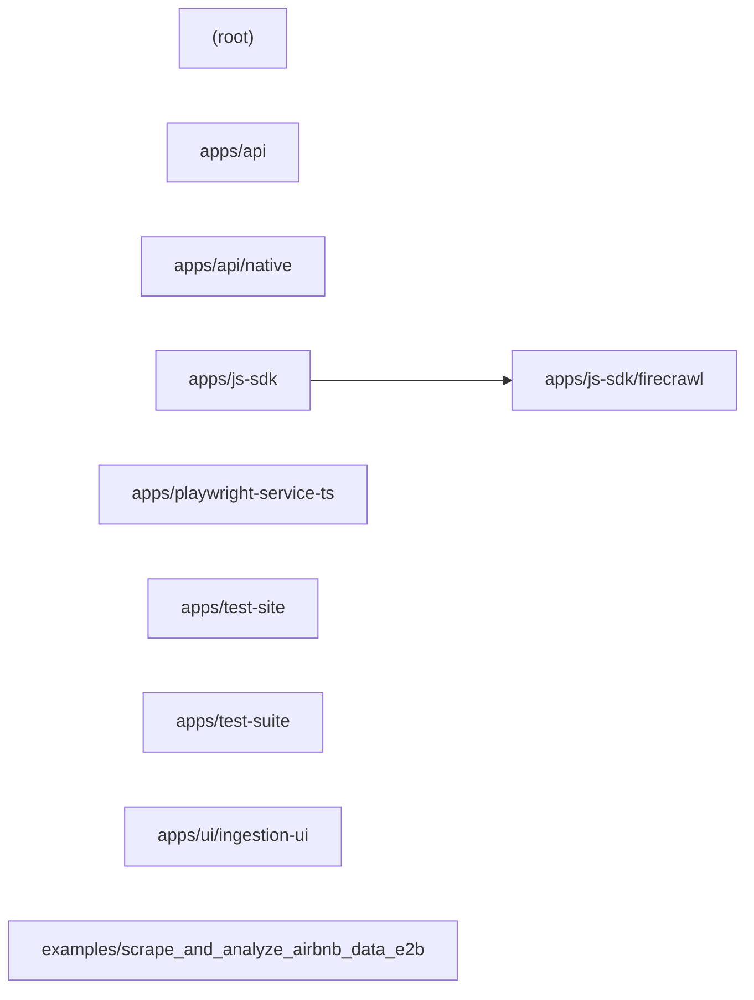

# Architecture — firecrawl/firecrawl

> Generated by Blacklight 0.1.0 on 2026-07-15T21:06:28.449Z.
> Target: `C:\Users\yulon\Desktop\Current Projects\Blacklight - system anatomy\vendor\github\firecrawl__firecrawl` (github).
>
> This is an **observation skeleton**: 4659 observed facts, 767 inferred.
> Interpretation and conclusions belong in `findings/architecture/`, not here.

## Components

| Component | Files | Path |
| --- | --- | --- |
| `(root)` | 661 | `` |
| `apps/api` | 700 | `apps/api` |
| `apps/api/native` | 32 | `apps/api/native` |
| `apps/js-sdk` | 13 | `apps/js-sdk` |
| `apps/js-sdk/firecrawl` | 68 | `apps/js-sdk/firecrawl` |
| `apps/playwright-service-ts` | 11 | `apps/playwright-service-ts` |
| `apps/test-site` | 71 | `apps/test-site` |
| `apps/test-suite` | 32 | `apps/test-suite` |
| `apps/ui/ingestion-ui` | 31 | `apps/ui/ingestion-ui` |
| `examples/scrape_and_analyze_airbnb_data_e2b` | 12 | `examples/scrape_and_analyze_airbnb_data_e2b` |

## Dependencies

- `apps/js-sdk` → `apps/js-sdk/firecrawl`

## Component diagram

## Graph size

- Nodes: 1339 (756 files, 10 components, 573 concepts)
- Edges: 4087
