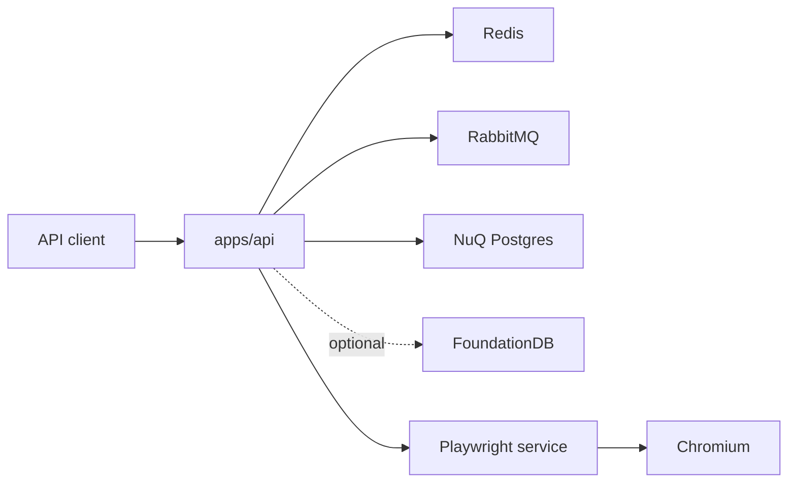
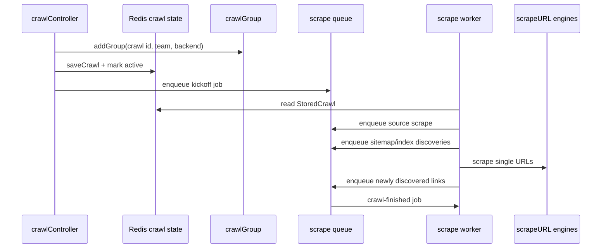

# Firecrawl Source Study

> Evidence document. This is a manual source reading of the cached
> `vendor/github/firecrawl__firecrawl` checkout. Interpretive conclusions belong in
> `../../findings/architecture/firecrawl-structure.md`.

## Snapshot

- Source cache: `vendor/github/firecrawl__firecrawl`
- Last visible cached commit: `3a7b1a7774291f6c1a72ff3eb0ac11187766723d`
- Commit date: `2026-07-15 09:44:04 -0700`
- Commit subject: `chore(ci): upgrade support services to pnpm 11 (#4034)`
- Static Blacklight graph: `1339` nodes, `4087` edges, `592` concepts.
- `apps/api/src`: `658` files, including `651` TypeScript files.
- Test surface observed by text search: `1804` `test(`/`it(` occurrences across
  `apps/api/src`, `apps/playwright-service-ts`, and `apps/js-sdk`.

No runtime execution was attempted in this pass. The local study is source-level only.

## Repository Layout

Firecrawl is a monorepo, but `apps/api` is the operational center. The repo also contains
SDKs, examples, a standalone Playwright microservice, CLI material, and deployment files.
The root has no `package.json`; the app scripts live in `apps/api/package.json`.

Important entrypoints:

- `apps/api/package.json:10` defines the production API server command.
- `apps/api/package.json:24` defines the older `queue-worker` command.
- `apps/api/package.json:26` and `apps/api/package.json:28` define NuQ worker commands.
- `apps/api/package.json:36` defines the extract worker.
- `apps/api/package.json:38` defines the indexing worker.
- `docker-compose.yaml:63` defines the Playwright service.
- `docker-compose.yaml:92` defines the API service.
- `docker-compose.yaml:121`, `docker-compose.yaml:138`, `docker-compose.yaml:156`, and
  `docker-compose.yaml:177` define Redis, RabbitMQ, NuQ Postgres, and FoundationDB.

## Deployment Topology

The self-hosted compose topology wires the API to Redis, RabbitMQ, NuQ Postgres, optional
FoundationDB, and a Playwright service:

The compose file injects `PLAYWRIGHT_MICROSERVICE_URL` at `docker-compose.yaml:27`, sets
`NUQ_BACKEND`/`FDB_CLUSTER_FILE` at `docker-compose.yaml:58`, passes `NUQ_RABBITMQ_URL` into
the API at `docker-compose.yaml:100`, and starts the API through
`node dist/src/harness.js --start-docker` at `docker-compose.yaml:114`.

## Crawl Control Flow

The v2 crawl controller is the cleanest top-level path:

- `apps/api/src/controllers/v2/crawl.ts:40` starts `crawlController`.
- It resolves threat protection and key/format permissions before creating work.
- It builds a `StoredCrawl`, including crawler options, scrape options, internal options,
  team id, webhook, max concurrency, zero-data-retention, and billing context.
- `apps/api/src/controllers/v2/crawl.ts:297` pins a queue backend for the crawl with
  `resolveNewGroupBackend`.
- `apps/api/src/controllers/v2/crawl.ts:298` creates the crawl group.
- `apps/api/src/controllers/v2/crawl.ts:309` persists the crawl.
- `apps/api/src/controllers/v2/crawl.ts:313` enqueues the kickoff job.

The worker side splits jobs by mode:

- `apps/api/src/services/worker/scrape-worker.ts:1493` defines `processJobInternal`.
- `apps/api/src/services/worker/scrape-worker.ts:1547` dispatches `mode === "kickoff"`.
- `apps/api/src/services/worker/scrape-worker.ts:1100` handles kickoff.
- `apps/api/src/services/worker/scrape-worker.ts:1323` handles kickoff sitemap jobs.
- `apps/api/src/services/worker/scrape-worker.ts:259` handles single URL jobs.

Observed crawl shape:

Kickoff uses `addScrapeJob` for the source URL, records it with `addCrawlJob`, sends the
optional `CRAWL_STARTED` webhook, explores sitemaps, asks the index for candidate URLs, locks
URLs, records crawl job IDs, and bulk-enqueues discovered jobs. The bulk enqueue sites are
visible at `apps/api/src/services/worker/scrape-worker.ts:1302` and
`apps/api/src/services/worker/scrape-worker.ts:1461`.

## Queues And Backpressure

Firecrawl has several queue mechanisms, not one:

- `apps/api/src/services/queue-service.ts` creates BullMQ queues for generate-llms-txt,
  deep research, billing, and precrawl.
- `apps/api/src/services/extract-queue.ts` uses RabbitMQ with a dead-letter queue for
  extraction jobs.
- `apps/api/src/services/worker/nuq.ts:94` defines the custom NuQ queue abstraction.
- `apps/api/src/services/worker/nuq.ts:1734` creates `scrapeQueue`.
- `apps/api/src/services/worker/nuq.ts:1737` creates `crawlFinishedQueue`.
- `apps/api/src/services/worker/nuq.ts:1739` creates `crawlGroup`.
- `apps/api/src/services/worker/nuq-router.ts:36` documents the Postgres/FoundationDB
  dual-backend migration router.

NuQ is Postgres-backed by default, with optional RabbitMQ for prefetch/listener paths:

- `apps/api/src/services/worker/nuq.ts:123` starts the listener.
- `apps/api/src/services/worker/nuq.ts:404` sends prefetch jobs to RabbitMQ when configured.
- `apps/api/src/services/worker/nuq.ts:808` adds one job.
- `apps/api/src/services/worker/nuq.ts:930` adds multiple jobs.
- `apps/api/src/services/worker/nuq.ts:1141` waits for completion through listen or poll mode.
- `apps/api/src/services/worker/nuq.ts:1290` dequeues the next job for a worker.

The router pins new crawl groups to a backend and routes reads/writes by crawl or job marker:

- `apps/api/src/services/worker/nuq-router.ts:105` resolves the backend for a new group.
- `apps/api/src/services/worker/nuq-router.ts:151` resolves the backend for a job.
- `apps/api/src/services/worker/nuq-router.ts:234` enqueues FDB-backed scrape jobs.
- `apps/api/src/services/worker/nuq-router.ts:321` defines the routed scrape queue.
- `apps/api/src/services/worker/nuq-router.ts:552` defines the routed crawl-finished queue.
- `apps/api/src/services/worker/nuq-router.ts:656` defines the routed crawl group.

Backpressure is enforced before enqueue:

- `apps/api/src/services/queue-jobs.ts:153` is the direct scrape enqueue helper.
- `apps/api/src/services/queue-jobs.ts:348` starts the main single-job enqueue path.
- `apps/api/src/services/queue-jobs.ts:422` branches into team/crawl concurrency backlog.
- `apps/api/src/services/queue-jobs.ts:429` throws `QueueFullError` at the team queue cap.
- `apps/api/src/services/queue-jobs.ts:500` exposes `addScrapeJob`.
- `apps/api/src/services/queue-jobs.ts:523` exposes `addScrapeJobs`.

The newer NuQ worker runner exposes metrics and liveness, takes jobs, renews locks, runs
`processJobInternal`, and finishes or fails jobs:

- `apps/api/src/services/worker/nuq-worker-runner.ts:49` defines `runNuqWorker`.
- `apps/api/src/services/worker/nuq-worker-runner.ts:74` exposes metrics.
- `apps/api/src/services/worker/nuq-worker-runner.ts:121` dequeues work.
- `apps/api/src/services/worker/nuq-worker-runner.ts:145` renews locks.
- `apps/api/src/services/worker/nuq-worker-runner.ts:164` runs scrape processing.
- `apps/api/src/services/worker/nuq-worker-runner.ts:174` and `:186` finish/fail jobs.

## Scrape Pipeline

The single URL worker calls `startWebScraperPipeline` at
`apps/api/src/services/worker/scrape-worker.ts:307`; that function lives at
`apps/api/src/main/runWebScraper.ts:8`. Crawls get up to three attempts in
`runWebScraper`, while non-crawls get one.

The scrape subsystem is centered on `apps/api/src/scraper/scrapeURL/index.ts`:

- `:178` builds request feature flags.
- `:343` builds the mutable `Meta` object that carries URL, options, logger, abort manager,
  mocks, prefetch slots, cost tracking, and threat decisions.
- `:668` starts the engine race/waterfall loop.
- `:706` asks the engine module for a fallback list.
- `:1058` runs result transformers.
- `:1078` exports `scrapeURL`.
- `:1111` checks threat protection before any engine work.
- `:1157` checks robots.txt when policy requires it.
- `:1329` re-checks redirect destinations against threat protection.

Engine definition and selection live in `apps/api/src/scraper/scrapeURL/engines/index.ts`:

- `:34` defines the engine union.
- `:65` builds the configured engine list.
- `:167` maps engine names to handlers.
- `:211` declares per-engine feature support and quality.
- `:517` decides when the index can be used.
- `:544` builds the fallback list.
- `:729` invokes an engine handler.

The engine set includes index cache, Fire Engine CDP/TLS variants, Playwright, fetch, PDF,
document, Wikipedia, and X/Twitter handlers. Selection is feature-driven: requested actions,
screenshots, files, mobile, location, proxy, branding, audio/video, and fast-mode all affect
which engines qualify.

## Browser Boundary

The Playwright service is a separate Node service in `apps/playwright-service-ts/api.ts`.
It launches Chromium at `:189`, controls concurrent browser pages with a semaphore at `:160`,
reports active page counts in status output around `:349`, and exposes `/scrape` at `:372`.
The API reaches it through `PLAYWRIGHT_MICROSERVICE_URL`.

This boundary is useful architecturally: browser memory, page concurrency, and Chromium
lifecycle are isolated from the API process.

## Safety, Policy, And Data Retention

Safety is layered across controller validation, key restrictions, threat protection, robots,
URL filtering, queue caps, crawl cancellation, and zero-data-retention handling.

Observed examples:

- The crawl controller blocks unsafe seed URLs before kickoff.
- `scrapeURL` blocks unsafe target URLs before engine selection and re-checks redirects.
- Crawl discovery silently skips blocked discovered links but records/bills first-time blocks.
- Robots decisions are checked in `scrapeURL` and robots-blocked discoveries are recorded.
- FDB-backed completed member jobs may shed input data for zero-data-retention crawls, and
  crawl finalization recovers context from stored crawl state.

## What Blacklight Should Reuse

- Treat long-running work as persisted groups plus small resumable jobs.
- Pin backend choice at group creation to keep migration logic out of most call sites.
- Keep job execution idempotent-ish by locking discovered URLs before enqueue.
- Move browser work behind a narrow service boundary.
- Make engine selection explicit: feature flags, support matrix, quality, and retry rules.
- Preserve observations separately from inferences. Firecrawl itself uses logs, spans, and
  metrics at almost every critical transition, which is exactly the kind of raw evidence
  Blacklight wants.

## Remaining Unknowns

- No local runtime trace was captured, so the actual timing and contention behavior under load
  remains unobserved.
- FDB behavior was read from source but not exercised.
- The source references Fire Engine, hosted services, billing, GCS, Supabase, and ACUC flags;
  local self-host docs say some hosted capabilities are not available in self-host mode.
- The static graph still has the generated unresolved CSS import noted in `unknowns.md`.
