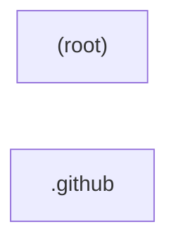

# Architecture — obsidianmd/obsidian-sample-plugin

> Generated by Blacklight 0.1.0 on 2026-07-16T14:15:33.647Z.
> Target: `C:\Users\yulon\Desktop\Current Projects\Blacklight - system anatomy\vendor\github\obsidianmd__obsidian-sample-plugin` (github).
>
> This is an **observation skeleton**: 13 observed facts, 7 inferred.
> Interpretation and conclusions belong in `findings/architecture/`, not here.

## Components

| Component | Files | Path |
| --- | --- | --- |
| `.github` | 2 | `.github` |
| `(root)` | 17 | `` |

## Dependencies

_No inter-component dependencies identified._

## Component diagram

## Graph size

- Nodes: 10 (5 files, 2 components, 3 concepts)
- Edges: 10
