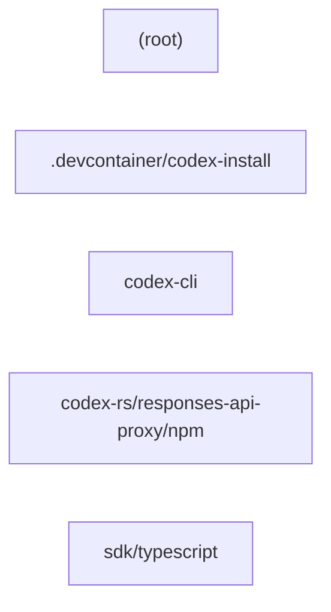

# Architecture — openai/codex

> Generated by Blacklight 0.1.0 on 2026-07-16T14:12:53.569Z.
> Target: `C:\Users\yulon\Desktop\Current Projects\Blacklight - system anatomy\vendor\github\openai__codex` (github).
>
> This is an **observation skeleton**: 3210 observed facts, 643 inferred.
> Interpretation and conclusions belong in `findings/architecture/`, not here.

## Components

| Component | Files | Path |
| --- | --- | --- |
| `.devcontainer/codex-install` | 3 | `.devcontainer/codex-install` |
| `(root)` | 5437 | `` |
| `codex-cli` | 7 | `codex-cli` |
| `codex-rs/responses-api-proxy/npm` | 3 | `codex-rs/responses-api-proxy/npm` |
| `sdk/typescript` | 30 | `sdk/typescript` |

## Dependencies

_No inter-component dependencies identified._

## Component diagram

## Graph size

- Nodes: 1140 (638 files, 5 components, 497 concepts)
- Edges: 2713
