# Architecture — ultraworkers/claw-code

> Generated by Blacklight 0.1.0 on 2026-07-16T14:35:31.865Z.
> Target: `C:\Users\yulon\Desktop\Current Projects\Blacklight - system anatomy\vendor\github\ultraworkers__claw-code` (github).
>
> This is an **observation skeleton**: 0 observed facts, 40 inferred.
> Interpretation and conclusions belong in `findings/architecture/`, not here.

## Components

| Component | Files | Path |
| --- | --- | --- |
| `.claude` | 12 | `.claude` |
| `.github` | 9 | `.github` |
| `.omx` | 18 | `.omx` |
| `.port_sessions` | 4 | `.port_sessions` |
| `(root)` | 60 | `` |
| `assets` | 7 | `assets` |
| `assistant` | 1 | `assistant` |
| `bootstrap` | 1 | `bootstrap` |
| `bridge` | 1 | `bridge` |
| `buddy` | 1 | `buddy` |
| `cli` | 1 | `cli` |
| `components` | 1 | `components` |
| `constants` | 1 | `constants` |
| `coordinator` | 1 | `coordinator` |
| `docs` | 26 | `docs` |
| `entrypoints` | 1 | `entrypoints` |
| `hooks` | 1 | `hooks` |
| `keybindings` | 1 | `keybindings` |
| `memdir` | 1 | `memdir` |
| `migrations` | 1 | `migrations` |
| `moreright` | 1 | `moreright` |
| `native_ts` | 1 | `native_ts` |
| `outputStyles` | 1 | `outputStyles` |
| `plugins` | 1 | `plugins` |
| `reference_data` | 33 | `reference_data` |
| `remote` | 1 | `remote` |
| `rust` | 175 | `rust` |
| `schemas` | 1 | `schemas` |
| `screens` | 1 | `screens` |
| `scripts` | 8 | `scripts` |
| `server` | 1 | `server` |
| `services` | 1 | `services` |
| `skills` | 1 | `skills` |
| `state` | 1 | `state` |
| `tests` | 5 | `tests` |
| `types` | 1 | `types` |
| `upstreamproxy` | 1 | `upstreamproxy` |
| `utils` | 1 | `utils` |
| `vim` | 1 | `vim` |
| `voice` | 1 | `voice` |

## Dependencies

_No inter-component dependencies identified._

## Component diagram

```mermaid
graph LR
  n0_component_root["(root)"]
  n1_component_claude[".claude"]
  n2_component_github[".github"]
  n3_component_omx[".omx"]
  n4_component_port_sessions[".port_sessions"]
  n5_component_assets["assets"]
  n6_component_docs["docs"]
  n7_component_rust["rust"]
  n8_component_scripts["scripts"]
  n9_component_assistant["assistant"]
  n10_component_bootstrap["bootstrap"]
  n11_component_bridge["bridge"]
  n12_component_buddy["buddy"]
  n13_component_cli["cli"]
  n14_component_components["components"]
  n15_component_constants["constants"]
  n16_component_coordinator["coordinator"]
  n17_component_entrypoints["entrypoints"]
  n18_component_hooks["hooks"]
  n19_component_keybindings["keybindings"]
  n20_component_memdir["memdir"]
  n21_component_migrations["migrations"]
  n22_component_moreright["moreright"]
  n23_component_native_ts["native_ts"]
  n24_component_outputstyles["outputStyles"]
  n25_component_plugins["plugins"]
  n26_component_reference_data["reference_data"]
  n27_component_remote["remote"]
  n28_component_schemas["schemas"]
  n29_component_screens["screens"]
  n30_component_server["server"]
  n31_component_services["services"]
  n32_component_skills["skills"]
  n33_component_state["state"]
  n34_component_types["types"]
  n35_component_upstreamproxy["upstreamproxy"]
  n36_component_utils["utils"]
  n37_component_vim["vim"]
  n38_component_voice["voice"]
  n39_component_tests["tests"]
```

## Graph size

- Nodes: 40 (0 files, 40 components, 0 concepts)
- Edges: 0
