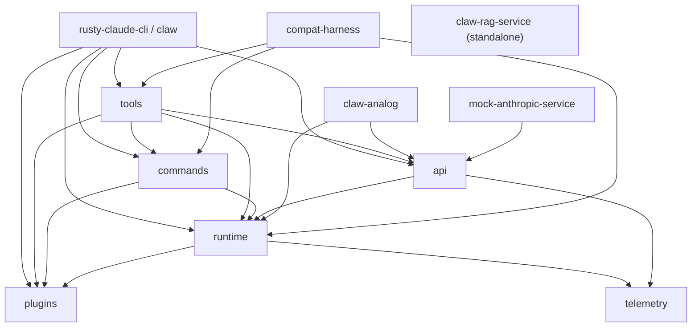

# Source Study: ultraworkers/claw-code

**Kind:** observation
**Snapshot:** `4ea31c1bc91c4e9bcbd67d51c550c01e127e6d0d`
**Snapshot date:** 2026-06-27
**Studied:** 2026-07-16

This document records direct observations from the git-ignored local source cache at
`vendor/github/ultraworkers__claw-code`. Interpretations belong in
`findings/architecture/claw-code-structure.md`.

## Study boundary

The cached checkout is a depth-one clone. It contains the current snapshot and one visible commit,
so this study can describe the checked-out implementation but cannot independently reconstruct its
development history, authorship distribution, or relationship to earlier source material.

The repository's own README says all of the following:

- `rust/` is the canonical implementation in this repository (`README.md:88-102`).
- `src/` and `tests/` are a companion Python/reference workspace (`README.md:99-102`).
- the repository does not claim ownership of original Claude Code source material and is not
  affiliated with Anthropic (`README.md:296-300`).

Those statements are observations about the repository's claims, not independent proof of origin.

## Measured shape

The original Blacklight ingest scanned 386 files and produced a 40-component directory skeleton.
A direct source inventory of the canonical Rust workspace found:

| Measure | Observed value |
| --- | ---: |
| Workspace crates | 11 |
| Rust files | 101 |
| Rust lines, all paths | 115,842 |
| Rust lines outside `tests/` directories | 104,432 |
| Rust lines in `tests/` directories | 11,410 |
| Built-in tool specifications | 55 |
| Rust test attributes | 1,416 |
| Ignored Rust test attributes | 0 |

The largest files are `rusty-claude-cli/src/main.rs` (19,831 lines), `tools/src/lib.rs`
(10,892), `commands/src/lib.rs` (7,183), `runtime/src/config.rs` (3,894), and
`plugins/src/lib.rs` (3,863). This is a crate-modular workspace with substantial concentration
inside three large dispatch modules.

The measured 11 crates, 115,842 lines, and 55 tools do not match the older 9-crate, roughly
48,000-line, 40-tool checkpoint described in `rust/README.md` and `PARITY.md`.

## Crate architecture

The workspace uses `members = ["crates/*"]` and forbids unsafe Rust
(`rust/Cargo.toml:1-16`). The crate dependency direction observed from Cargo manifests is:

| Crate | Direct role | Important local dependencies |
| --- | --- | --- |
| `rusty-claude-cli` | `claw` binary, argument parsing, REPL, rendering, runtime assembly | api, commands, runtime, plugins, tools |
| `runtime` | conversation loop, prompts, sessions, config, permissions, hooks, sandbox, MCP, worker state | plugins, telemetry |
| `api` | provider routing, Anthropic/OpenAI-compatible HTTP and SSE normalization | runtime, telemetry |
| `tools` | tool schemas and execution, sub-agent runtime | api, commands, plugins, runtime |
| `commands` | slash-command catalog, parsing, and rendering | plugins, runtime |
| `plugins` | plugin manifests, lifecycle, hooks, and external tools | none of the core crates |
| `claw-analog` | smaller alternate agent harness and optional RAG client | api, runtime |
| `claw-rag-service` | standalone workspace index and query service | no core harness crate |
| `compat-harness` | compatibility helpers | commands, tools, runtime |
| `mock-anthropic-service` | deterministic local Messages API server | api |
| `telemetry` | trace event types and JSONL tracing | no local dependencies |



The primary executable enters through `rusty-claude-cli/src/main.rs:330`, parses into
`CliAction` (`main.rs:1163-1280`), and dispatches local commands, one-shot prompts, resume mode,
or the REPL in `run()` (`main.rs:995-1159`).

## Runtime assembly

`build_runtime_with_plugin_state()` (`main.rs:12394-12443`) assembles one live runtime in this
order:

1. Persist the selected model in session metadata.
2. Initialize enabled plugins.
3. Build a permission policy from built-in, runtime, and plugin tool requirements.
4. Construct the provider-facing client.
5. Construct the CLI tool executor.
6. Create `ConversationRuntime` with hooks and the assembled system prompt.
7. Attach terminal hook progress reporting when output is enabled.

The historical name `AnthropicRuntimeClient` now wraps a provider enum. Its source comment says
the name is retained to avoid churn (`main.rs:12528-12544`). Construction routes Anthropic models
to `AnthropicClient` with a session prompt cache and routes xAI/OpenAI-compatible models through
the provider factory (`main.rs:12547-12610`).

## One conversation turn

`ConversationRuntime::run_turn()` is the core harness loop
(`runtime/src/conversation.rs:325-533`):

```text
user input
  -> append to Session
  -> build API request from system prompt + full session
  -> stream and normalize assistant events
  -> append assistant message
  -> optionally compact
  -> for each tool use:
       pre-tool hook
       permission decision
       tool execution or denial result
       post-tool hook
       append tool result
  -> repeat model call while tool uses remain
  -> return turn summary and cumulative usage
```

The runtime supports multiple tool calls in one assistant message by collecting every `ToolUse`
block before execution. The loop's default iteration limit is `usize::MAX`; bounded sub-agents set
their own limit (`conversation.rs:146-220`, `tools/src/lib.rs:4202-4208`).

The API boundary is deliberately narrow: `ApiClient::stream(ApiRequest)` returns normalized
`AssistantEvent` values, while `ToolExecutor::execute(name, input)` returns text or `ToolError`
(`conversation.rs:51-79`). This keeps provider wire formats outside the core loop.

## Providers and streaming

Provider selection is based primarily on model aliases and prefixes, with credential sniffing as a
fallback (`api/src/providers/mod.rs:206-406`). The currently represented provider kinds are
Anthropic, xAI, and OpenAI-compatible. OpenAI-compatible configuration also covers gateways and
local endpoints.

Both provider paths normalize their streams into the same events. The OpenAI-compatible adapter
reassembles fragmented tool calls by index and maps provider-specific reasoning fields into
thinking blocks (`api/src/providers/openai_compat.rs:436-620`). Before a request is sent, a rough
serialized-size token estimate checks known model context limits
(`api/src/providers/mod.rs:633-704`).

After a tool result, the CLI applies a first-event stall timeout and retries the same continuation
once (`main.rs:12648-12673`). Context-window failures trigger up to four progressively more
aggressive compaction rounds, preserving 4, 2, 1, then 0 recent messages
(`main.rs:7793-7968`).

## System prompt and project context

The system prompt is assembled as ordered sections rather than one fixed string
(`runtime/src/prompt.rs:153-237`). It contains:

- a coding-agent introduction and operating rules;
- model family, working directory, date, and platform;
- git status and bounded staged/unstaged diff context;
- project instruction files;
- merged runtime configuration.

Instruction discovery walks from the current directory to the nearest git root and loads, in
parent-to-child order, `CLAUDE.md`, `CLAW.md`, `AGENTS.md`, `CLAUDE.local.md`, `.claw/CLAUDE.md`,
`.claude/CLAUDE.md`, `.claw/instructions.md`, and sorted `.claw/rules*` files
(`prompt.rs:289-387`). Optional imports support Cursor, Copilot, Windsurf, Plandex, and Crush rule
formats (`prompt.rs:389-412`).

Config discovery loads five JSON locations in increasing precedence: legacy user config, user
settings, project legacy config, project settings, then local settings. Objects are deep-merged in
that order (`runtime/src/config.rs:409-496`).

## Tools and permission path

`mvp_tool_specs()` declares 55 built-in tools and a required permission for each
(`tools/src/lib.rs:484-1346`). The surface includes:

- shell and file primitives;
- web fetch/search;
- todos, skills, notebooks, config, structured output, and local REPL execution;
- task, worker, team, and cron operations;
- LSP and MCP operations;
- git inspection tools;
- sub-agent spawning.

Tool availability has three layers: built-ins, plugin tools, and runtime-discovered MCP tools.
`GlobalToolRegistry` rejects name conflicts, applies `--allowedTools`, provides aliases, and builds
the definitions sent to the model (`tools/src/lib.rs:127-434`).

The outer conversation loop evaluates `PermissionPolicy` before every tool call. The decision order
is: unconditional denied tools, deny rules, hook override, ask rules, allow rules/current mode, then
prompt-or-deny escalation (`runtime/src/permissions.rs:330-505`). Pre-tool hooks can replace input,
request allow/ask/deny, or cancel the call (`conversation.rs:374-487`).

File operations independently canonicalize against the current workspace and reject traversal and
symlink escapes (`tools/src/lib.rs:2450-2493`, `runtime/src/file_ops.rs`). Bash can request Linux
namespace, network, and filesystem isolation; real namespace isolation depends on Linux `unshare`
support (`runtime/src/sandbox.rs:158-230`). The PowerShell executor performs permission
classification but launches PowerShell directly and returns no sandbox status
(`tools/src/lib.rs:6566-6734`).

## Sessions and compaction

New sessions are bound to a canonical workspace fingerprint and stored under
`<workspace>/.claw/sessions/<workspace_hash>/` (`runtime/src/session_control.rs:10-72`). The
primary format is append-oriented JSONL, with compatibility loading for legacy JSON
(`runtime/src/session.rs:430-579`).

JSONL serialization redacts common API-key and bearer-token markers and truncates oversized fields
before persistence (`session.rs:1007-1189`). Session metadata carries model, workspace binding,
lineage, and compaction information. The CLI persists after successful turns
(`main.rs:7751-7783`).

Automatic compaction is checked after every assistant iteration, including terminal iterations.
The default threshold is 100,000 input tokens and can be overridden by
`CLAUDE_CODE_AUTO_COMPACT_INPUT_TOKENS` (`conversation.rs:12-16`, `conversation.rs:325-533`).

## Plugins, MCP, and extensibility

Plugins accept `plugin.json` or `.claude-plugin/plugin.json`, but the loader explicitly rejects or
warns about Claude Code manifest fields it does not implement, including plugin-managed skills,
MCP servers, agents, and markdown slash commands (`plugins/src/lib.rs:1665-1726`). Implemented
plugin contributions are lifecycle commands, shell hooks, and executable tools. Enabled plugin
lifecycle initialization occurs during runtime construction, before the first model turn.

MCP configuration recognizes stdio, SSE, HTTP, WebSocket, SDK, and managed-proxy transports
(`runtime/src/config.rs:1477-1495`). The live CLI path builds concrete stdio clients and surfaces
unsupported or failed servers as degraded state; discovered MCP tools are inserted into the same
tool registry used for built-ins.

LSP is not equivalent in maturity. Diagnostics can be returned from registry state, but other
actions return a structured `dispatched` placeholder instead of making LSP JSON-RPC calls
(`runtime/src/lsp_client.rs:240-295`).

## Agent and coordination surfaces

The `Agent` tool creates a markdown task file and JSON manifest, then starts a named background
thread (`tools/src/lib.rs:4091-4200`). That thread creates a fresh `ConversationRuntime`, runs one
bounded turn, and persists completion or failure (`tools/src/lib.rs:4202-4230`). Sub-agent types
receive explicit tool allowlists (`tools/src/lib.rs:4257-4335`). The sub-agent permission policy is
`DangerFullAccess`; therefore the parent `Agent` approval and the subtype allowlist are the main
boundary for delegated execution (`tools/src/lib.rs:4338-4343`).

Task, team, and cron tools use process-global in-memory registries. Team and cron source comments
describe them as in-memory lifecycle backing, not a worker fleet or scheduler
(`runtime/src/team_cron_registry.rs:1-9`). LSP similarly models registry state more deeply than it
implements external process communication.

`claw-rag-service` is a separate SQLite/embedding HTTP service. It is consumed by `claw-analog`,
not wired into the primary `claw` dependency graph.

## Verification surface

The snapshot contains 1,416 `#[test]` or `#[tokio::test]` attributes and no `#[ignore]` attributes.
The largest concentrations are CLI unit tests, output-format contracts, tool tests, provider
normalization, config, permissions, and session behavior.

The deterministic mock parity manifest defines 12 scenarios covering streaming text, file tools,
multi-tool turns, bash, permission approval/denial, plugin tools, auto-compaction, and token/cost
reporting (`rust/mock_parity_scenarios.json`). CI declares formatting, full workspace tests, full
workspace clippy, documentation checks, and a Windows PowerShell smoke job
(`.github/workflows/rust-ci.yml`).

The Rust suite was not executed in this Blacklight study because `cargo` is not installed in the
current workspace environment and the cached checkout has no built `target/` directory. Test counts
and CI commands are source observations, not a claim that the snapshot currently passes them.

## Observed incompleteness and drift

- ACP/Zed returns an unsupported status and exits with code 2 (`main.rs:1092-1095`).
- LSP actions beyond cached diagnostics are placeholders (`runtime/src/lsp_client.rs:272-295`).
- team and cron are in-memory lifecycle registries, not distributed execution.
- several worker health fields are explicitly placeholders (`runtime/src/worker_boot.rs`).
- `TestingPermission` returns a test stub payload (`tools/src/lib.rs:2026-2033`).
- PowerShell execution has policy checks but no OS sandbox integration.
- the current source inventory has outgrown crate, line, and tool counts in the top-level docs.
